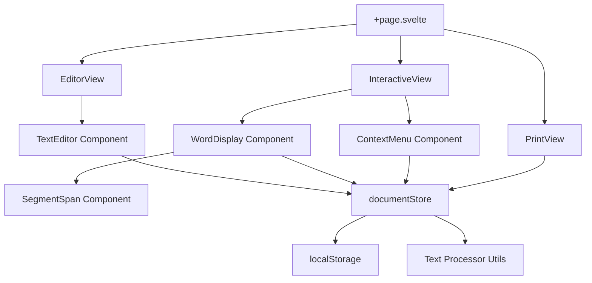

# Design Document: FluencyMark

## Overview

FluencyMark is a single-page client-side application built with SvelteKit (Svelte 5 runes) and Tailwind CSS v4. It enables speech therapists and people who stutter to interactively mark disfluency moments on text at the word or sub-word level. The application operates entirely in the browser with localStorage persistence — no backend required.

The app has two primary modes:
1. **Edit Mode** — user pastes/uploads text
2. **Interactive Mode** — user marks disfluencies on processed words

A print/PDF export produces a formatted report with color legend and footnotes.

## Architecture



The application uses a single reactive store (`documentStore`) as the source of truth. All components read from and write to this store. The store handles serialization/deserialization to localStorage automatically via `$effect`.

### Mode Routing

The main `+page.svelte` conditionally renders one of three views based on `documentStore.mode`:
- `'edit'` → `EditorView`
- `'interactive'` → `InteractiveView`
- `'print'` → triggered via `window.print()` with print-specific CSS

No SvelteKit routing is used beyond the single page — mode switching is purely state-driven.

## Components and Interfaces

### Component Tree

```
src/
├── routes/
│   ├── +page.svelte          # Main page, mode router
│   └── +layout.svelte        # Global layout with Tailwind import
├── lib/
│   ├── components/
│   │   ├── EditorView.svelte       # Textarea + file upload + confirm button
│   │   ├── InteractiveView.svelte  # Word grid + selection handling
│   │   ├── WordDisplay.svelte      # Single word with segments
│   │   ├── SegmentSpan.svelte      # Individual segment (marked/unmarked)
│   │   ├── ContextMenu.svelte      # Floating menu for type/note selection
│   │   └── PrintView.svelte        # Print-optimized layout with legend
│   ├── stores/
│   │   └── documentStore.svelte.ts # Central state with Svelte 5 runes
│   ├── types.ts                    # All TypeScript interfaces
│   └── utils/
│       ├── textProcessor.ts        # Raw text → Word_Object[] conversion
│       ├── segmentUtils.ts         # Segment splitting/merging logic
│       └── storage.ts              # localStorage serialize/deserialize
```

### Component Responsibilities

**EditorView.svelte**
- Renders textarea for text input
- Handles .txt file upload via `<input type="file" accept=".txt">`
- "Zatwierdź" button triggers text processing and mode switch
- Debounced auto-save of raw text to localStorage

**InteractiveView.svelte**
- Renders processed words as a flowing text layout
- Listens for `mouseup` events to detect text selection via `window.getSelection()`
- Determines if selection is within a single word boundary
- Manages context menu visibility and position
- "Wróć do edycji" button to return to edit mode

**WordDisplay.svelte**
- Renders a single Word_Object as a sequence of SegmentSpan components
- Handles click events for whole-word marking
- Provides data attributes for selection boundary detection

**SegmentSpan.svelte**
- Renders a single Segment with appropriate background color if marked
- Displays footnote reference number if segment has a note

**ContextMenu.svelte**
- Positioned absolutely near the target word/selection
- Shows three disfluency type buttons with colors
- Optional note text input
- "Usuń oznaczenie" button for already-marked segments
- Closes on outside click or Escape key

**PrintView.svelte**
- Rendered within `@media print` CSS
- Displays all words with colored backgrounds
- Generates color legend at document end
- Generates numbered footnotes for segments with notes

## Data Models

### TypeScript Interfaces (`src/lib/types.ts`)

```typescript
export type DisfluencyType = 'block' | 'repetition' | 'prolongation';

export interface DisfluencyConfig {
  type: DisfluencyType;
  label: string;       // Polish label
  color: string;       // Tailwind color class for display
  printColor: string;  // Hex color for print CSS
}

export const DISFLUENCY_TYPES: Record<DisfluencyType, DisfluencyConfig> = {
  block: { type: 'block', label: 'Blokada', color: 'bg-red-200', printColor: '#fecaca' },
  repetition: { type: 'repetition', label: 'Powtórzenie', color: 'bg-yellow-200', printColor: '#fef08a' },
  prolongation: { type: 'prolongation', label: 'Przedłużenie', color: 'bg-blue-200', printColor: '#bfdbfe' },
};

export interface Segment {
  id: string;
  text: string;
  isMarked: boolean;
  type?: DisfluencyType;
  note?: string;
}

export interface WordObject {
  id: string;
  text: string;          // Original full word text
  segments: Segment[];
}

export type AppMode = 'edit' | 'interactive';

export interface DocumentState {
  mode: AppMode;
  rawText: string;
  words: WordObject[];
}
```

### State Store (`src/lib/stores/documentStore.svelte.ts`)

The store uses Svelte 5 runes for reactivity:

```typescript
import { type DocumentState, type WordObject, type AppMode } from '$lib/types';
import { serialize, deserialize } from '$lib/utils/storage';
import { processText } from '$lib/utils/textProcessor';

const STORAGE_KEY = 'fluencymark-state';

function createDocumentStore() {
  let state = $state<DocumentState>(loadInitialState());

  function loadInitialState(): DocumentState {
    const saved = deserialize(STORAGE_KEY);
    if (saved) return saved;
    return { mode: 'edit', rawText: '', words: [] };
  }

  // Auto-persist on state changes
  $effect(() => {
    serialize(STORAGE_KEY, state);
  });

  return {
    get mode() { return state.mode; },
    get rawText() { return state.rawText; },
    get words() { return state.words; },

    setRawText(text: string) { state.rawText = text; },
    
    confirmText() {
      state.words = processText(state.rawText);
      state.mode = 'interactive';
    },
    
    returnToEdit() {
      state.mode = 'edit';
      state.words = [];
    },
    
    updateWord(wordId: string, updatedWord: WordObject) {
      const index = state.words.findIndex(w => w.id === wordId);
      if (index !== -1) state.words[index] = updatedWord;
    },
  };
}

export const documentStore = createDocumentStore();
```

### Utility Functions

**textProcessor.ts** — Splits raw text by whitespace, preserving line breaks as special tokens:

```typescript
export function processText(rawText: string): WordObject[] {
  // Split by whitespace, filter empty strings
  // Assign unique IDs (crypto.randomUUID())
  // Each word starts with a single unmarked segment
}
```

**segmentUtils.ts** — Handles segment splitting and merging:

```typescript
export function splitSegment(word: WordObject, segmentId: string, startOffset: number, endOffset: number): WordObject {
  // Splits a segment at the given character offsets
  // Returns new WordObject with updated segments array
}

export function markSegment(word: WordObject, segmentId: string, type: DisfluencyType, note?: string): WordObject {
  // Marks a specific segment with a disfluency type
}

export function unmarkSegment(word: WordObject, segmentId: string): WordObject {
  // Removes marking from a segment
  // Merges adjacent unmarked segments
}

export function mergeAdjacentUnmarked(segments: Segment[]): Segment[] {
  // Combines consecutive unmarked segments into one
}
```

**storage.ts** — JSON serialization with error handling:

```typescript
export function serialize(key: string, state: DocumentState): void {
  try {
    localStorage.setItem(key, JSON.stringify(state));
  } catch (e) {
    console.error('Failed to save state:', e);
  }
}

export function deserialize(key: string): DocumentState | null {
  try {
    const raw = localStorage.getItem(key);
    if (!raw) return null;
    const parsed = JSON.parse(raw);
    // Validate structure
    if (!isValidDocumentState(parsed)) return null;
    return parsed;
  } catch {
    return null;
  }
}

export function isValidDocumentState(data: unknown): data is DocumentState {
  // Type guard validating the shape of deserialized data
}
```

### Selection Detection Logic

The `InteractiveView` uses `window.getSelection()` on `mouseup` to detect fragment selections:

```typescript
function handleMouseUp() {
  const selection = window.getSelection();
  if (!selection || selection.isCollapsed) return;

  const range = selection.getRangeAt(0);
  
  // Find the WordObject container element
  const wordElement = findWordContainer(range.startContainer);
  if (!wordElement) { selection.removeAllRanges(); return; }
  
  // Ensure selection is within a single word
  const endWordElement = findWordContainer(range.endContainer);
  if (wordElement !== endWordElement) { selection.removeAllRanges(); return; }
  
  // Calculate character offsets within the word
  const { startOffset, endOffset } = calculateOffsets(wordElement, range);
  
  // Trigger segment split and show context menu
  openContextMenu(wordElement.dataset.wordId, startOffset, endOffset);
}
```

### Print/PDF Strategy

The print view uses `@media print` CSS rules:
- Hide UI controls (buttons, context menu)
- Show all marked text with inline background colors
- Append a legend section mapping colors to Polish labels
- Append numbered footnotes for segments with notes
- Use `window.print()` to trigger the browser's native print dialog


## Correctness Properties

*A property is a characteristic or behavior that should hold true across all valid executions of a system — essentially, a formal statement about what the system should do. Properties serve as the bridge between human-readable specifications and machine-verifiable correctness guarantees.*

### Property 1: Serialization Round-Trip

*For any* valid DocumentState object (containing any combination of words, segments, markings, notes, and mode), serializing to JSON and then deserializing SHALL produce a DocumentState that is deeply equal to the original.

**Validates: Requirements 9.4, 9.1, 9.2, 2.2, 7.2**

### Property 2: Invalid Data Graceful Handling

*For any* arbitrary string that is not valid JSON or does not conform to the DocumentState schema, deserializing SHALL return null (triggering empty state initialization) without throwing an exception.

**Validates: Requirements 9.3**

### Property 3: Text Processing Content Preservation

*For any* non-empty input string, processing it into Word_Objects SHALL produce words whose concatenated text (joined by single spaces) contains all non-whitespace characters from the original input in the same order. No non-whitespace content is lost or reordered.

**Validates: Requirements 3.1, 1.4**

### Property 4: Text Processing Structural Invariants

*For any* non-empty input string, processing it into Word_Objects SHALL produce a list where every Word_Object has a unique ID and exactly one Segment with `isMarked === false` and `text` equal to the Word_Object's `text` field.

**Validates: Requirements 3.2, 3.3**

### Property 5: Segment Text Invariant (Split and Merge)

*For any* Word_Object and any valid split operation (splitting a segment at character offsets) or unmark/merge operation, the concatenation of all resulting segment texts SHALL equal the original Word_Object's `text` field. No characters are lost, added, or reordered.

**Validates: Requirements 5.2, 6.6**

### Property 6: Marking Produces Correct Structure

*For any* Word_Object with a single unmarked segment and any DisfluencyType, marking the whole word SHALL produce a Word_Object with exactly one segment where `isMarked === true`, `type` equals the chosen DisfluencyType, and `text` equals the original word text.

**Validates: Requirements 4.2**

### Property 7: Footnote Consistency

*For any* list of Word_Objects containing segments with notes, generating footnotes SHALL produce a numbered list where each footnote number corresponds exactly to the inline reference number on the segment, and every segment with a note has exactly one footnote entry.

**Validates: Requirements 8.4, 8.5**

### Property 8: Fragment Selection Boundary Detection

*For any* word text and any pair of valid character offsets (0 ≤ start < end ≤ text.length), the selection detection logic SHALL correctly identify the start and end boundaries within that word, producing offsets that define a non-empty substring of the word.

**Validates: Requirements 5.1**

## Error Handling

### localStorage Errors

- **Quota exceeded**: `serialize()` catches `QuotaExceededError` and logs a warning. The app continues operating with in-memory state.
- **Corrupted data**: `deserialize()` returns `null` for any invalid JSON or schema mismatch. The app starts fresh.
- **Unavailable localStorage**: If `localStorage` is not available (private browsing in some browsers), the app operates without persistence and shows a Polish warning message.

### File Upload Errors

- **Wrong file type**: Files without `.txt` extension are rejected with a Polish error message ("Proszę wybrać plik .txt").
- **File read errors**: `FileReader.onerror` triggers a Polish error message ("Nie udało się odczytać pliku").
- **Empty file**: An empty .txt file is accepted — the textarea is populated with an empty string.

### Selection Errors

- **Cross-word selection**: Silently ignored (selection cleared, no context menu).
- **Empty selection**: Ignored (collapsed selections produce no action).
- **Selection outside word boundaries**: Ignored.

### State Consistency

- **Invalid segment offsets**: `splitSegment()` validates that offsets are within bounds. Invalid offsets are clamped to valid range.
- **Orphaned segments**: `mergeAdjacentUnmarked()` is called after every unmark operation to prevent accumulation of adjacent unmarked segments.

## Testing Strategy

### Testing Framework

- **Unit tests**: Vitest (already compatible with the Vite setup)
- **Property-based tests**: `fast-check` library with Vitest
- **Component tests**: `@testing-library/svelte` for component rendering tests

### Property-Based Tests

Each correctness property maps to a dedicated property-based test file. Configuration:
- Minimum 100 iterations per property test
- Each test tagged with: `Feature: fluency-mark, Property N: [title]`

**Test files:**
- `src/lib/utils/storage.test.ts` — Properties 1, 2
- `src/lib/utils/textProcessor.test.ts` — Properties 3, 4
- `src/lib/utils/segmentUtils.test.ts` — Properties 5, 6, 8
- `src/lib/utils/footnotes.test.ts` — Property 7

### Unit Tests (Example-Based)

Unit tests cover specific scenarios, edge cases, and UI interactions:
- Editor renders textarea in edit mode
- File upload accepts .txt and rejects other types
- Context menu appears on word click
- Context menu closes on outside click
- Mode transitions (edit → interactive → edit)
- Print view renders legend with used types only

### Generators (for Property Tests)

Custom `fast-check` arbitraries:
- `arbDisfluencyType`: one of 'block', 'repetition', 'prolongation'
- `arbSegment`: random segment with optional marking
- `arbWordObject`: random word with valid segment structure
- `arbDocumentState`: random complete state with mode, rawText, and words
- `arbRawText`: random text with whitespace, newlines, and unicode characters
- `arbInvalidJson`: random strings that are not valid DocumentState JSON

### Test Organization

```
src/lib/
├── utils/
│   ├── storage.test.ts          # Properties 1-2 + unit tests
│   ├── textProcessor.test.ts    # Properties 3-4 + unit tests
│   ├── segmentUtils.test.ts     # Properties 5-6, 8 + unit tests
│   └── footnotes.test.ts        # Property 7 + unit tests
├── components/
│   ├── EditorView.test.ts       # Component unit tests
│   ├── ContextMenu.test.ts      # Component unit tests
│   └── InteractiveView.test.ts  # Component unit tests
```
