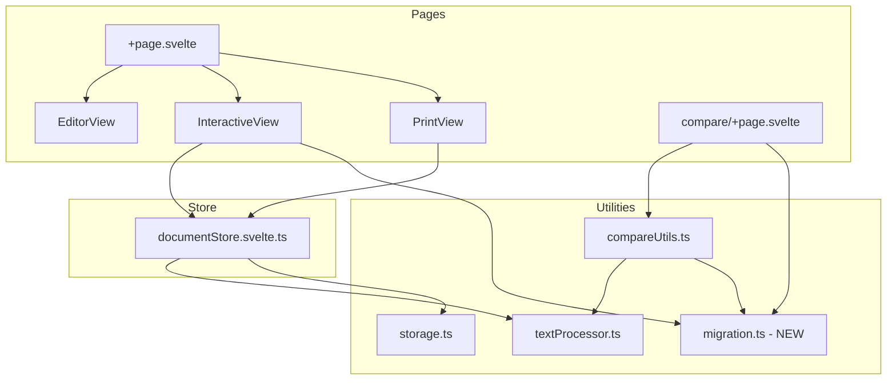

# Design Document: Simplify Word Marking

## Overview

This design simplifies FluencyMark's word marking system from a complex segment-based model (with disfluency types, color coding, context menus, and partial word selection) to a minimal whole-word toggle. Each word becomes a simple `{id, text, isMarked}` object. The export format changes from v1 (segment-level marks with types) to v2 (flat array of marked word indices). A migration utility converts legacy v1 files to the new format, and the compare page supports both formats.

### Key Design Decisions

1. **Flat word model** — Removing the `segments` array eliminates all fragment-related complexity. A word is either marked or not.
2. **Export v2 format** — Storing only `markedIndices` (positional integers) instead of per-word segment arrays reduces file size and simplifies parsing.
3. **Shared migration function** — The same `migrateLegacyData` function is used by both the Interactive View's "Importuj stary JSON" button and the Compare Page's import logic.
4. **Delete, don't deprecate** — `ContextMenu.svelte`, `SegmentSpan.svelte`, `segmentUtils.ts`, and all `DisfluencyType`-related code are removed entirely rather than hidden behind feature flags.

## Architecture



### Component Changes Summary

| Component | Action | Rationale |
|-----------|--------|-----------|
| `ContextMenu.svelte` | **Delete** | No context menu in simplified system |
| `SegmentSpan.svelte` | **Delete** | No segments; words render directly |
| `WordDisplay.svelte` | **Simplify** | Renders word text directly with marked class |
| `InteractiveView.svelte` | **Simplify** | Remove mouseup handler, segment splitting, context menu state; add legacy import button |
| `PrintView.svelte` | **Simplify** | Remove type labels, colors, notes; show plain sorted list |
| `compare/+page.svelte` | **Rewrite** | Support v1 and v2 imports, uniform highlight, no color/type display |

## Components and Interfaces

### WordDisplay.svelte (Simplified)

```svelte
<script lang="ts">
  import type { WordObject } from '$lib/types';

  let { word, onToggleMark }: {
    word: WordObject;
    onToggleMark: (wordId: string) => void;
  } = $props();

  function handleClick(event: MouseEvent) {
    const selection = window.getSelection();
    if (selection && !selection.isCollapsed) {
      selection.removeAllRanges();
      return;
    }
    onToggleMark(word.id);
  }
</script>

<span
  class="word-display"
  class:marked={word.isMarked}
  data-word-id={word.id}
  onclick={handleClick}
  role="button"
  tabindex="0"
  onkeydown={(e) => {
    if (e.key === 'Enter' || e.key === ' ') {
      e.preventDefault();
      onToggleMark(word.id);
    }
  }}
>{word.text}</span>
```

The component no longer iterates over segments or renders `SegmentSpan`. It applies a single `.marked` CSS class when `word.isMarked` is true.

### InteractiveView.svelte (Simplified)

Key changes:
- Remove all `ContextMenu` imports and state
- Remove `handleMouseUp` (segment splitting logic)
- Remove `splitSegment`, `markSegment`, `unmarkSegment` imports
- Simplify `handleToggleMark` to a single boolean flip
- Add "Importuj stary JSON" button calling `migrateLegacyImport`
- Clear browser selection on mouseup to prevent sub-word highlighting

```typescript
function handleToggleMark(wordId: string) {
  documentStore.toggleMark(wordId);
}

function handleLegacyImport() {
  const input = document.createElement('input');
  input.type = 'file';
  input.accept = '.json';
  input.onchange = () => {
    const file = input.files?.[0];
    if (!file) return;
    const reader = new FileReader();
    reader.onload = () => {
      const result = documentStore.importLegacyJson(reader.result as string);
      if (!result.success) {
        importError = result.error;
        setTimeout(() => (importError = ''), 4000);
      }
    };
    reader.readAsText(file);
  };
  input.click();
}
```

### PrintView.svelte (Simplified)

Derives a sorted list of marked word texts (lowercase, punctuation-stripped) and displays them as a flat list with a count. No type labels, colors, or notes.

### documentStore.svelte.ts (Simplified)

```typescript
// New simplified store interface
interface DocumentStore {
  get mode(): AppMode;
  get rawText(): string;
  get words(): WordObject[];

  setRawText(text: string): void;
  confirmText(): void;
  returnToEdit(): void;
  toggleMark(wordId: string): void;
  exportToJson(): string;
  importFromJson(json: string): { success: boolean; error?: string };
  importLegacyJson(json: string): { success: boolean; error?: string };
}
```

The `toggleMark` method replaces `updateWord` — it simply flips `word.isMarked`. The `exportToJson` method produces v2 format. The `importFromJson` method handles v2 imports. The `importLegacyJson` method handles v1 migration.

### migration.ts (New Utility)

```typescript
import type { WordObject } from '$lib/types';
import { processText } from './textProcessor';

export interface LegacyExportData {
  version: 1;
  rawText: string;
  marks: LegacyExportMark[];
}

export interface LegacyExportMark {
  wordIndex: number;
  segments: { text: string; isMarked: boolean; type?: string; note?: string }[];
}

export interface ExportDataV2 {
  version: 2;
  rawText: string;
  markedIndices: number[];
}

/**
 * Validates that parsed JSON conforms to legacy v1 format.
 */
export function validateLegacyData(data: unknown): LegacyExportData | null { ... }

/**
 * Validates that parsed JSON conforms to v2 format.
 */
export function validateV2Data(data: unknown): ExportDataV2 | null { ... }

/**
 * Converts legacy v1 export data to a simplified word array.
 * A word is marked if ANY segment in the legacy data was marked.
 */
export function migrateLegacyToWords(legacy: LegacyExportData): WordObject[] {
  const words = processText(legacy.rawText);
  for (const mark of legacy.marks) {
    if (mark.wordIndex >= 0 && mark.wordIndex < words.length) {
      const hasAnyMarked = mark.segments.some(s => s.isMarked);
      if (hasAnyMarked) {
        words[mark.wordIndex] = { ...words[mark.wordIndex], isMarked: true };
      }
    }
  }
  return words;
}

/**
 * Reconstructs word array from v2 export data.
 */
export function reconstructFromV2(data: ExportDataV2): WordObject[] {
  const words = processText(data.rawText);
  for (const index of data.markedIndices) {
    if (index >= 0 && index < words.length) {
      words[index] = { ...words[index], isMarked: true };
    }
  }
  return words;
}
```

### compareUtils.ts (Updated)

The compare utilities are updated to:
1. Accept both v1 and v2 formats (detect via `version` field)
2. Use `migrateLegacyToWords` for v1 files
3. Use `reconstructFromV2` for v2 files
4. Validate rawText match between two imports

```typescript
export function validateAndReconstructWords(
  data: unknown
): { success: true; words: WordObject[]; rawText: string } | { success: false; error: string } {
  if (data === null || typeof data !== 'object') {
    return { success: false, error: 'Nieprawidłowy format pliku.' };
  }
  const obj = data as Record<string, unknown>;

  if (obj.version === 1) {
    const legacy = validateLegacyData(data);
    if (!legacy) return { success: false, error: 'Nieprawidłowy format pliku v1.' };
    return { success: true, words: migrateLegacyToWords(legacy), rawText: legacy.rawText };
  }

  if (obj.version === 2) {
    const v2 = validateV2Data(data);
    if (!v2) return { success: false, error: 'Nieprawidłowy format pliku v2.' };
    return { success: true, words: reconstructFromV2(v2), rawText: v2.rawText };
  }

  return { success: false, error: 'Nierozpoznany format pliku.' };
}
```

## Data Models

### Current (v1) WordObject — Being Removed

```typescript
// OLD — will be deleted
interface Segment {
  id: string;
  text: string;
  isMarked: boolean;
  type?: DisfluencyType;
  note?: string;
}

interface WordObject {
  id: string;
  text: string;
  segments: Segment[];
}
```

### New WordObject

```typescript
interface WordObject {
  id: string;
  text: string;
  isMarked: boolean;
}
```

### New types.ts

```typescript
export interface WordObject {
  id: string;
  text: string;
  isMarked: boolean;
}

export type AppMode = 'edit' | 'interactive';

export interface DocumentState {
  mode: AppMode;
  rawText: string;
  words: WordObject[];
}
```

All `DisfluencyType`, `DisfluencyConfig`, `DISFLUENCY_TYPES`, and `Segment` types are removed.

### Export Format v2

```typescript
interface ExportDataV2 {
  version: 2;
  rawText: string;
  markedIndices: number[];  // 0-based indices of marked words
}
```

Example:
```json
{
  "version": 2,
  "rawText": "Ala ma kota i psa",
  "markedIndices": [0, 2, 4]
}
```

### Legacy Export Format v1 (Read-Only for Migration)

```typescript
interface LegacyExportData {
  version: 1;
  rawText: string;
  marks: { wordIndex: number; segments: { text: string; isMarked: boolean; type?: string; note?: string }[] }[];
}
```

### localStorage Schema Change

The persisted `DocumentState` changes shape. The `storage.ts` validator is updated to accept the new `WordObject` shape (no segments). On first load after upgrade, if the stored state has the old shape (words with segments), it is discarded (returns null), forcing the user back to the edit view.

## Correctness Properties

*A property is a characteristic or behavior that should hold true across all valid executions of a system — essentially, a formal statement about what the system should do. Properties serve as the bridge between human-readable specifications and machine-verifiable correctness guarantees.*

### Property 1: Toggle inverts marked state

*For any* word with a boolean `isMarked` value, calling `toggleMark` on that word SHALL produce a word where `isMarked` is the logical negation of the original value.

**Validates: Requirements 1.1, 1.2, 2.4, 3.2**

### Property 2: Word structure invariant

*For any* raw text string, calling `processText` SHALL produce an array of words where each word has exactly three properties: a string `id`, a string `text`, and a boolean `isMarked` (initially false), with no additional properties.

**Validates: Requirements 1.3, 2.1, 2.3, 4.3, 5.1, 5.2**

### Property 3: Export produces valid v2 structure

*For any* document state (arbitrary raw text and arbitrary marked/unmarked words), calling `exportToJson` SHALL produce a JSON string that, when parsed, contains exactly `{version: 2, rawText: string, markedIndices: number[]}` where `markedIndices` contains exactly the indices of words with `isMarked === true`, sorted in ascending order.

**Validates: Requirements 5.3, 5.4**

### Property 4: Export/Import round-trip

*For any* document state, exporting to v2 JSON and then importing that JSON SHALL reconstruct a word array where each word's `isMarked` state matches the original.

**Validates: Requirements 5.3, 8.2**

### Property 5: Legacy migration marks word if any segment was marked

*For any* valid v1 export data, the migration function SHALL produce a word array where `word.isMarked === true` if and only if the corresponding legacy mark entry has at least one segment with `isMarked === true`.

**Validates: Requirements 7.3, 7.4, 8.1**

### Property 6: Invalid input rejection

*For any* input that is not valid JSON, or is valid JSON but lacks a `version` field equal to 1 or 2, or is missing required fields (`rawText`, `marks`/`markedIndices`), the validation functions SHALL return a failure result.

**Validates: Requirements 7.6, 8.5**

### Property 7: Print summary formatting

*For any* set of marked words, the print summary list SHALL be sorted according to Polish locale (`'pl'`) collation on the cleaned text (lowercase, leading/trailing punctuation removed), and each displayed word SHALL equal its original text transformed to lowercase with leading/trailing punctuation stripped.

**Validates: Requirements 6.1, 6.4**

### Property 8: Marked word count accuracy

*For any* document state, the displayed marked word count SHALL equal the number of words in the array where `isMarked === true`.

**Validates: Requirements 6.3**

### Property 9: Compare page rejects mismatched texts

*For any* two export data objects (v1 or v2) where the `rawText` fields differ, the compare page import logic SHALL reject the second file with an error.

**Validates: Requirements 8.6**

## Error Handling

| Scenario | Behavior |
|----------|----------|
| Legacy import: invalid JSON | Display "Plik nie jest rozpoznanym formatem starszej wersji." error for 4 seconds |
| Legacy import: valid JSON but wrong structure (no version:1, missing rawText/marks) | Same error message |
| Legacy import: valid v1 with zero marks | Load text with all words unmarked (no error) |
| V2 import: invalid structure | Display "Nieprawidłowy plik JSON. Sprawdź format." error for 4 seconds |
| Compare page: unrecognized version | Display "Nierozpoznany format pliku." |
| Compare page: rawText mismatch | Display "Teksty w obu plikach różnią się. Porównanie wymaga tego samego tekstu źródłowego." |
| localStorage: old format detected | Discard stored state, start fresh in edit mode |
| localStorage: quota exceeded | Log error, continue operating in-memory (existing behavior) |

## Testing Strategy

### Property-Based Tests (fast-check)

The project does not currently have a test framework. We will add `vitest` and `fast-check` as dev dependencies.

**Configuration:**
- Library: `fast-check` with `vitest`
- Minimum iterations: 100 per property
- Tag format: `Feature: simplify-word-marking, Property {N}: {title}`

**Property tests to implement:**

1. **Toggle inverts state** — Generate random `WordObject`, call toggle, assert `isMarked` flipped.
2. **Word structure invariant** — Generate random strings, call `processText`, assert shape.
3. **Export v2 structure** — Generate random word arrays with random marks, export, parse, validate schema.
4. **Export/Import round-trip** — Generate random state, export, import, compare marks.
5. **Legacy migration** — Generate random v1 data with random segments, migrate, verify `isMarked` matches `segments.some(s => s.isMarked)`.
6. **Invalid input rejection** — Generate random non-conforming objects, verify validation returns null/error.
7. **Print summary formatting** — Generate random marked words, verify sort order and text cleaning.
8. **Marked word count** — Generate random word arrays, verify count equals filter length.
9. **Compare rejects mismatched texts** — Generate two different rawText strings, verify rejection.

### Unit Tests (vitest)

- **Example tests** for UI behavior (button presence, no context menu rendering)
- **Edge cases**: empty text, single word, all words marked, no words marked, unicode text, punctuation-only words
- **Migration edge cases**: v1 file with zero marks, v1 file with all segments unmarked in a mark entry

### Integration Tests

- Full flow: enter text → mark words → export → import → verify state
- Legacy flow: import v1 file → verify conversion → export as v2
- Compare flow: import v1 + v2 files with same text → verify display

### Files to Delete

- `src/lib/components/ContextMenu.svelte`
- `src/lib/components/SegmentSpan.svelte`
- `src/lib/utils/segmentUtils.ts`

### Files to Create

- `src/lib/utils/migration.ts`
- `vitest.config.ts`
- `src/lib/utils/__tests__/migration.test.ts`
- `src/lib/utils/__tests__/textProcessor.test.ts`
- `src/lib/utils/__tests__/export.test.ts`
- `src/lib/utils/__tests__/printSummary.test.ts`

### Files to Modify

- `src/lib/types.ts` — Remove all disfluency types, Segment interface; simplify WordObject
- `src/lib/stores/documentStore.svelte.ts` — New toggle/export/import methods, remove segment logic
- `src/lib/components/WordDisplay.svelte` — Remove SegmentSpan, render text directly
- `src/lib/components/InteractiveView.svelte` — Remove context menu, segment splitting; add legacy import
- `src/lib/components/PrintView.svelte` — Remove colors/types/notes, simplify list
- `src/lib/utils/storage.ts` — Update validator for new WordObject shape
- `src/lib/utils/compareUtils.ts` — Support v1+v2, use migration utility
- `src/lib/utils/textProcessor.ts` — Return `{id, text, isMarked: false}` instead of segments
- `src/routes/compare/+page.svelte` — Use new compareUtils, uniform highlight, no colors
- `package.json` — Add vitest, fast-check, @testing-library/svelte
